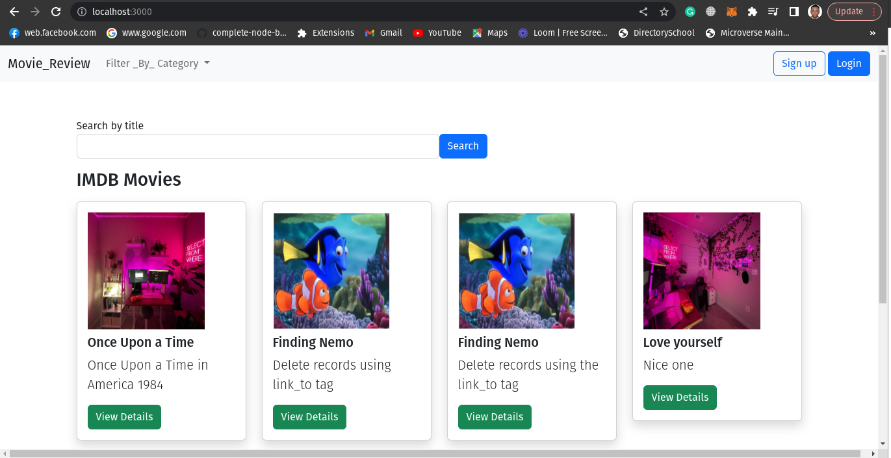
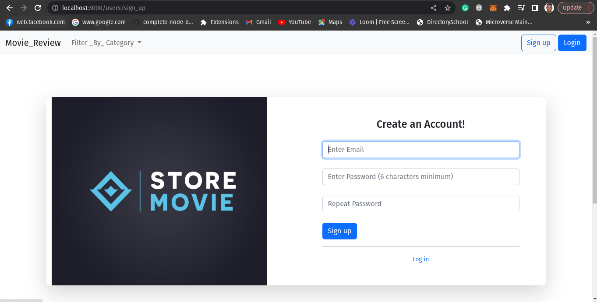
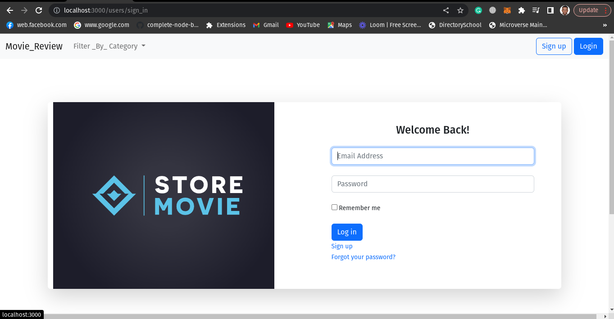
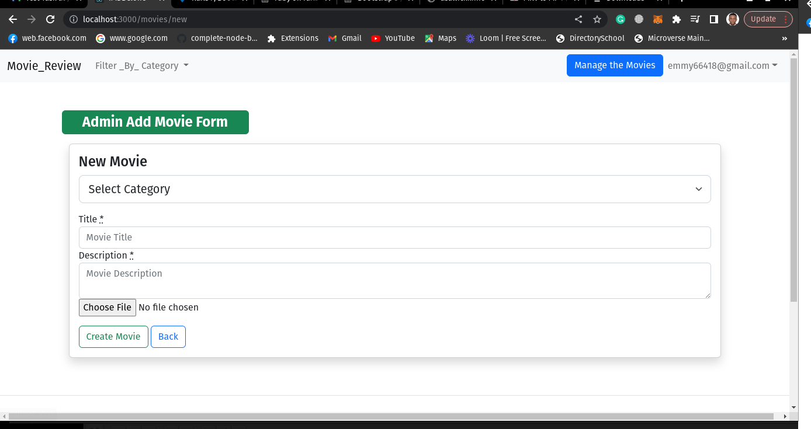
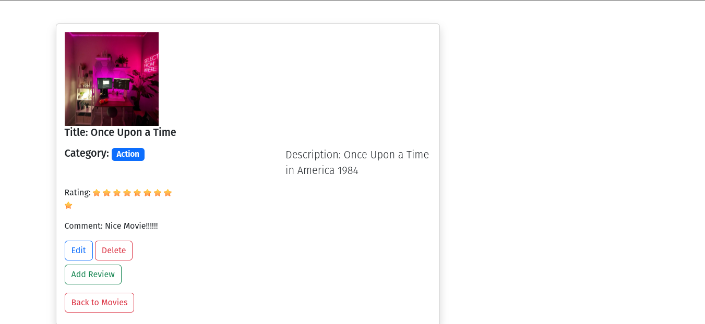

# IMDB CLONE DEMO 

> IMDB CLONE is a demo for creating a Movie with the following options: image, title, description based on this condition `User should search using title and filter the movie by category` and later a user should search the video [h/she] needs to search to be displayed on screen or it should display no result found if the video doesn't exist.

## Features

- Movie: Title, Text, Ratings, Category

- Rating system from 1-10 available to registered users

- The home page that shows all movies and the ability to filter movies by categories (URL drove and SEO Friendly)

- Movie Details Page that shows the average rating

- From the Home page, it is possible to provide a quick star rating without reloading a page.

- Admin Interface to manage movies (CRUD)

- Pagination of Movies on Home Page

- Deploy an application to cloud servers like a Heroku or DigitalOcean

- Provide test coverage for the app using RSpec or TDD

- Use bootstrap or similar for the UI

- The page should display an empty input field for the search term and a submit button

### Deployed Link

[Live Link](https://immense-garden-27567.herokuapp.com/)

### Screenshot of the IMDB_CLONE_VERSION

### Screenshot of the Homepage


### Screenshot of the signup/login page




### Screenshot of the adminPage


### Screenshot of the rating



## Getting Started

To get a local copy up and running follow these simple example steps:


## Built With

* Ruby v3.0.0
* Ruby on Rails v7.0.4
* Postgres: >=13.4-1
* SQLite3
* Node.js v16.10.0
* Yarn v1.22.18


### Setup and Install

* Open your terminal - Windows: `Win + R`, then type `cmd` | Mac: `Command + space`, then type `Terminal`
* Navigate to a directory of your choosing using the `cd` command
* Run this command in your OS terminal: `https://github.com/Emmyn5600/IMDB_CLONE_VERSION.git` to get a copy of the project
* Navigate to the project's directory using the `cd` command
* Install dependencies by running `bundle install`
* Migrate the database to your environment by running `rails db:create` then `rails db:migrate`
* Run `rails webpacker:install` to configure Webpacker for your environment. Otherwise, an error like `Webpacker::Manifest::MissingEntryError` will appear if you attempt to run the server.
* Execute `rails server` to fire up the server
* Visit `http://localhost:3000/` in your browser to get into the app
* Interact with the app
* To close the server, enter `Ctrl + C` in your terminal

### Setup

Instal gems with:

```
bundle install

yarn install
```

Setup database with:

```
   rails db:create
   rails db:seed
   rails db:migrate
```

### Github Actions

To make sure the linters' checks using Github Actions work properly, you should follow the next steps:

1. On your recently forked repo, enable the GitHub Actions in the Actions tab.
2. Create the `feature/branch` and push.
3. Start working on your milestone as usual.
4. Open a PR from the `feature/branch` when your work is done.

### Usage

Start server with:

```
    rails server
```

Open `http://localhost:3000/` in your browser.

### Run tests

```
    bundle exec rspec
```

👤 **NSABIMANA Emmanuel**

- GitHub: [@emmyn5600](https://github.com/Emmyn5600)
- Twitter: [@NSABIMA62253884](https://twitter.com/NSABIMA62253884)
- LinkedIn: [@nsabimana-emmanuel-4276091b2](https://www.linkedin.com/in/nsabimana-emmanuel-4276091b2/)

## Credits

Thanks to [IDMB](http://www.imdb.com/) for awesome design work.

## 🤝 Contributing

Contributions, issues, and feature requests are welcome!

Feel free to check the [issues/](https://github.com/Emmyn5600/IMDB_CLONE_VERSION/issues).
